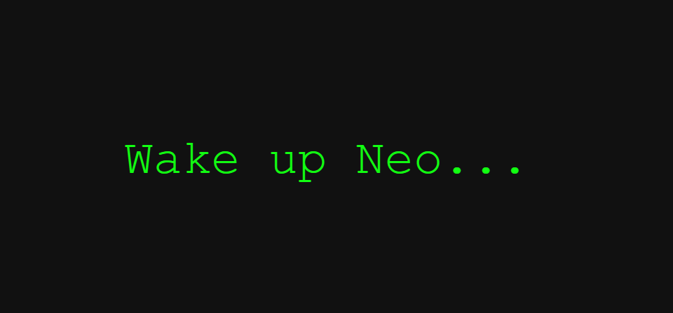
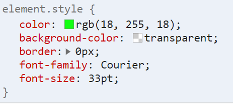

# React online marathon

## The tasks of the topic Styles:

### Modify React Elements:
- `App` component at *./components/app/app.js*
    - import *app.css* as css-file
    - add html attr:class `wrapper-app` to `div` tag

- `Button` component at *./components/button/button.js*
    - add inner text `Wake up Neo...`
    - add inline styles to `button` tag with this values:
    
    

